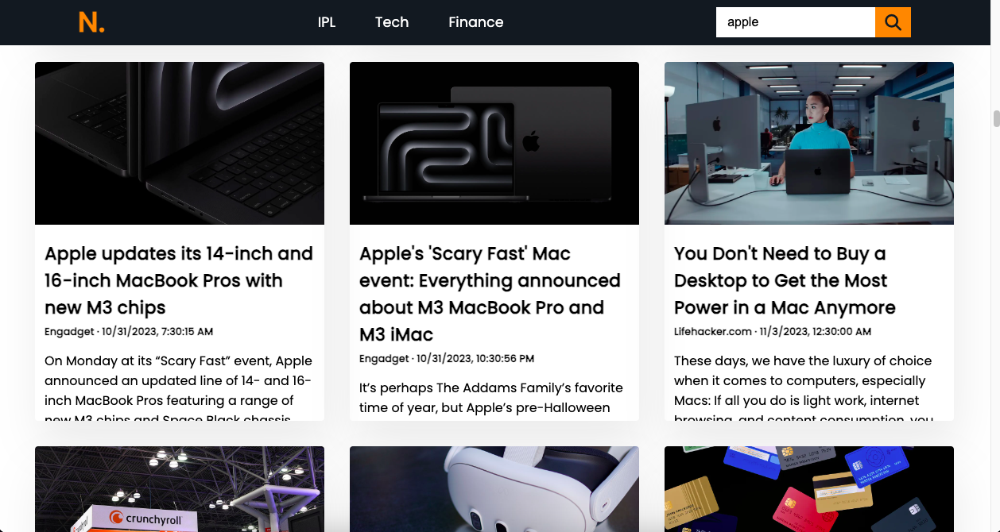

  
  
  
  
   
  <h2 align="center">Responsiv News Website</h2>
  

### Demo Screeshots

🚀 I've achieved success in creating a news website with HTML, CSS and JavaScript. This project has deepened my understanding of API fetch and the art of deep cloning using the DOM manipulation.

## 🔥 Some key features of this effort include:

- *Real-Time Updates.
- *User-Friendly UI.
- *Engaging Thumbnails.
- *Search Functionality.

## Usage

- Upon opening the web app, you'll instantly see the latest news headlines.
- Use the search functionality to find news articles on specific topics.

## API Key

To run the application, you'll need an API key from [News API](newsapi.org) . Insert your API key in `script.js`:

javascript
const API_KEY = 'YOUR_API_KEY';

## Contact
Connect with me on LinkedIn : [Anil Kunda ↗](https://www.linkedin.com/in/anillkunda/)
